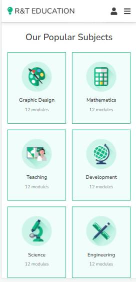

# R & T EDUCATION WEBSITE :school:
Code to create website theme Education with HTML, SASS, JAVASCRIPT.

# TARGETS :pushpin: :rocket:
* Use mixins sass.
* Web responsive design.
* Create slider with Swiper CDN.

# TOOLS & TECH :wrench: :hammer:

* HTML
* CSS 
* SASS 
* JAVASCRIPT

# SCREENSHOT

